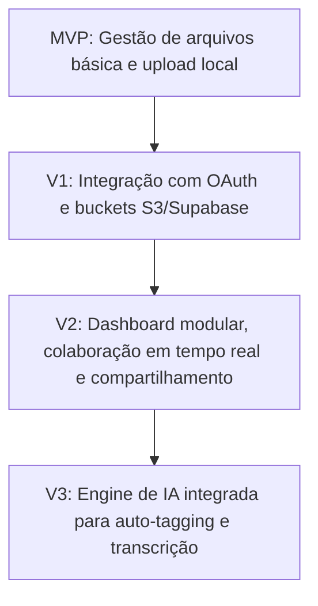

# PRD: MediaShelf Creative OS

Este documento de requisitos do produto (PRD) estabelece as diretrizes de desenvolvimento, arquitetura de dados e roadmap técnico para a construção do **MediaShelf Creative OS**.

---

## 1. Visão Geral & Objetivos

O **MediaShelf** é uma plataforma centralizada de gestão criativa (Digital Asset Management - DAM) que permite a criadores de conteúdo e equipes de mídia gerenciar, classificar, arquivar e distribuir ativos digitais em um ambiente multicloud integrado e seguro.

### Objetivos do Negócio
- Eliminar a fragmentação de ativos digitais espalhados por diferentes nuvens.
- Prover um dashboard modular, fluido e altamente responsivo.
- Permitir colaboração segura entre múltiplos usuários e clientes através de controle granular de acessos.

---

## 2. Arquitetura & Stack Tecnológica

| Componente | Tecnologia Recomendada | Finalidade |
| :--- | :--- | :--- |
| **Frontend** | React / Next.js (App Router) | Interface rica, SSR e performance otimizada. |
| **Styling** | Tailwind CSS + Shadcn/UI | Consistência e design system flexível. |
| **Banco de Dados** | Supabase (PostgreSQL) | Persistência de metadados, controle de usuários e Realtime. |
| **Storage** | Supabase Storage / AWS S3 | Armazenamento físico de ativos de alta resolução. |
| **Autenticação** | Supabase Auth (OAuth Google/GitHub) | Fluxo de autenticação moderno e seguro. |

---

## 3. Especificação de Funcionalidades (Escopo)

### [F1] Autenticação e Gestão de Usuários
- Login e cadastro simplificado via redes sociais.
- Perfil de usuário com preferências de exibição (Grid/Lista, Dark/Light Mode).
- Níveis de permissão: `Owner`, `Editor`, `Viewer`.

### [F2] Upload e Armazenamento Inteligente
- Suporte a upload múltiplo de arquivos pesados (Vídeos, Imagens RAW, Áudios, PDFs).
- Geração automática de miniaturas (*thumbnails*) para otimização de banda.
- Compressão inteligente opcional para visualização rápida.

### [F3] Classificação e Busca por Tags
- Tags dinâmicas associadas a cada arquivo.
- Sistema de categorização avançado (Projetos, Clientes, Tipos de Mídia).
- Busca rápida por metadados com filtros por data, extensão de arquivo e tag.

### [F4] Colaboração e Compartilhamento Seguro
- Geração de links públicos temporários com expiração configurável.
- Área de comentários e feedbacks diretamente no arquivo visualizado.

---

## 4. Modelo de Dados (Database Schema)

```sql
-- Tabela de Usuários (Sincronizada com Supabase Auth)
CREATE TABLE public.profiles (
    id UUID REFERENCES auth.users ON DELETE CASCADE PRIMARY KEY,
    name TEXT NOT NULL,
    avatar_url TEXT,
    role VARCHAR(20) DEFAULT 'editor' CHECK (role IN ('owner', 'editor', 'viewer')),
    created_at TIMESTAMP WITH TIME ZONE DEFAULT TIMEZONE('utc'::text, NOW()) NOT NULL
);

-- Tabela de Projetos
CREATE TABLE public.projects (
    id UUID DEFAULT gen_random_uuid() PRIMARY KEY,
    title TEXT NOT NULL,
    description TEXT,
    owner_id UUID REFERENCES public.profiles(id) ON DELETE CASCADE,
    created_at TIMESTAMP WITH TIME ZONE DEFAULT TIMEZONE('utc'::text, NOW()) NOT NULL
);

-- Tabela de Ativos (Files)
CREATE TABLE public.assets (
    id UUID DEFAULT gen_random_uuid() PRIMARY KEY,
    project_id UUID REFERENCES public.projects(id) ON DELETE CASCADE,
    title TEXT NOT NULL,
    file_path TEXT NOT NULL, -- Caminho no Bucket de Storage
    file_size BIGINT NOT NULL,
    mime_type TEXT NOT NULL,
    uploaded_by UUID REFERENCES public.profiles(id) ON DELETE SET NULL,
    tags TEXT[],
    created_at TIMESTAMP WITH TIME ZONE DEFAULT TIMEZONE('utc'::text, NOW()) NOT NULL
);
```

---

## 5. Roadmap de Desenvolvimento (MVP ao V3)


